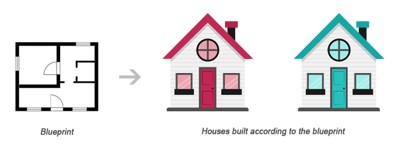
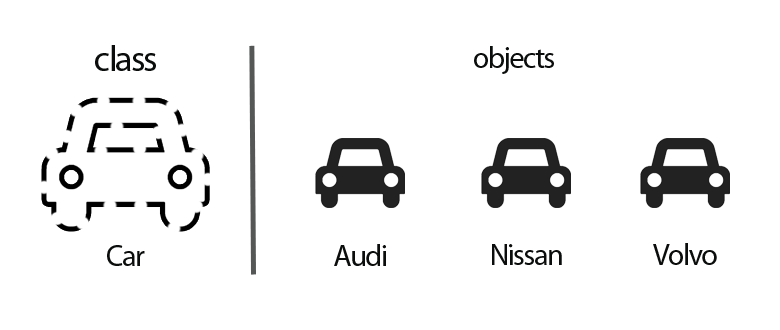
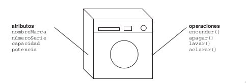
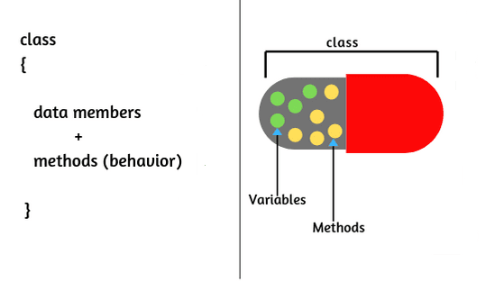

# Repaso a la Programación orientada a Objetos 
---
## ¿Qué haremos en esta Clase?
- Discutir los conceptos básicos de la Programación Orientada a Objetos y tratarlos con un ejemplo en C#.
- Explorar c/u de los Pilares de la Programación Orientada a Objetos.
- Proponer un ejercicio evaluado cuya resolución cubra los temas aquí tratados.

---

## 1 Programación Orientada a Objetos
La programación estructurada enfoca su resolución desde la división del problema en problemas cada vez más pequeños. Usamos funciones para colocar zonas especializadas de código o código que se usa constantemente en su interior.

El paradigma estructurado es correcto, pero tiene algunas limitaciones y algunos problemas cuando la solución es compleja.  Además su mantenibilidad es limitada y costosa. Generalmente, un cambio en una parte del programa produce cambios en otras partes que quizá no estén relacionadas directamente. En general, los programas estructurados son poco flexibles.

En la programación orientada a Objetos (OOP) el enfoque de resolución de problemas es diferente. En lugar de subdividirlos, lo que hará es ver cuáles son los componentes u Objetos que componen el problema y la forma cómo interactúan. Luego Ud. programará estos Objetos y la comunicación entre ellos. Cuando los Objetos hagan su labor y se comuniquen, el problema estará resuelto.

La Programación procedimental enfatiza en Algoritmos mientras que la OOP Enfatiza en los datos.

*La idea de la OOP es hacer una abstracción de la realidad para que la solución que Ud. diseñe sea lo más ad-hoc al problema de la vida real que se le plantea.*

entonces.. ¿Qué es un Objeto?

### 1.1 Objeto
La idea de la OOP es combinar en una Única Unidad tanto los datos (atributos) como las funciones (métodos) que operan sobre esos datos. Esta unidad es el Objeto.

Luego, podríamos definir Objeto como una Entidad individual que se caracteriza por tener:

| UN ESTADO Y UN COMPORTAMIENTO 	|
|-------------------------------	|


**Estado**: Son los valores que toman sus datos (atributos).


**Comportamiento**: Definido por la funcionalidad de la Clase que originará el Objeto (los métodos).

Para crear un Objeto debe:

1.- crear una *Clase*. 

2.- *Instanciar* la Clase que creó en el paso anterior.

Y, ¿Que es una Clase?

### 1.2 Clase 

Es la plantilla de donde se generan cuantos Objetos Ud. necesitará. Veálo como un plano que contiene las especificaciones de lo que será el Objeto. Piense en una casa. Para construir una casa primero define cuantos pisos, cuartos, ventanas etc. quiere. Luego dibuja el plano. El plano no es la casa. No podrá vivir ni actuar en él plano. Gracias al plano construirá la casa y en esta construcción sí podrá llevar a cabo sus actividades.



Lo mejor es que, ese plano le sirve para construir otra casa, y cuantas necesite.

El mismo razonamiento anterior, sirve para cualquier Objeto de la vida real, que luego Ud. llevará al ambito de la Programación.  



>Vea los Objetos que lo rodean. Todos tienen sus propiedades (color, tamaño, forma etc.) y su comportamiento (arranca, muestra, escribe etc.). Todos tienen sus atributos y métodos.  Este ejercicio mental, lo ayudará a ganar destreza diseñando sistemas.

En esencia, una Clase es un tipo de datos, así:

Es un tipo de dato que contiene **ATRIBUTOS Y MÉTODOS**

Entonces, ¿Cómo hacemos una Clase?

Para declarar Clases, el esquema es este:

```
class nombre {
    //atributos
    ..
    ..
    //métodos
    ..
    ..
}
```

**Los atributos** son la información con la que trabajará la Clase. La Clase *solo debe tener los datos necesarios para ejecutar su trabajo*. La declaración de los atributos de una Clase es similar a la declaración de variables pero especificando su forma de acceso.  Estos pueden ser: *público* y *privado*. 
Con los datos de acceso público cualquier elemento del exterior, como la función Main() o algún otro Objeto, puede acceder al dato, leerlo y modificarlo. 

```
public string marca;
```

Cuando tenemos el acceso privado solamente los métodos definidos dentro de la Clase podrán leerlo o modificarlo.

```
private int edad;
```

**Los métodos** son las funciones que llevan a cabo el proceso o la lógica de la Clase. Análogo a los datos, Ud. debe definir su tipo de acceso. 

Los métodos trabajarán sobre los datos de la Clase. Es importante resaltar que **todos los métodos conocen todos los datos definidos dentro de la Clase, y pueden recibir parámetros y regresar valores**. A un atributo definido dentro de la Clase no necesitamos pasarlo como parámetro ya que el método lo conoce. **Tendrán acceso público únicamente los métodos que necesiten ser invocados desde el exterior**. Si el método sólo se invoca desde el interior de la Clase su acceso debe ser privado. Esto lo hacemos con fines de seguridad y para mantener el **encapsulamiento** correctamente.

Los métodos son el único medio para acceder a los atributos del Objeto. Es decir,

| los atributos deden estar ocultos 	|
|-----------------------------------	|


Suponga que Ud. programa soluciones para el [Internet-de-las-cosas](https://www.redhat.com/es/topics/internet-of-things/what-is-iot).  Necesita apagar las luces de su casa, medir la temperatura de la nevera, prender la lavadora etc. con su teléfono inteligente.  



<sup>1</sup>

Para llegar a esa solución, los electrodomesticos de su casa serán los Objetos que interactuan en su app. Si un electrodomestico es un Objeto, tiene atributos y métodos.  Para que sea Objeto, antes debe definir la Clase. Veamos el código de esta Clase en C#:

```
// 
public class electrodomestico {
  // datos de la Clase
  public string marca;
  public string modelo;
  public string nroDeSerie;
  public float capacidad;
  public float potencia;
  public double precio;

  //métodos de la Clase
  public void prender() {
    Console.WriteLine("Se inicia encendido de este aparato");
  }

  public void apagar() {
    Console.WriteLine("Se inicia apagado de este aparato");
  }
}

```

En este código, hemos declarado una Clase base 'electrodomestico'. Por los momentos, tenemos dos métodos genéricos que al ser públicos, pueden ser invocados desde el exterior de la Clase.


### 1.3 Protección de Datos y creación de Propiedades

Un problema de la Clase anterior 'electrodomestico', es que sus datos son públicos.  Para mantener la integridad de la OOP (Los métodos son el único medio para acceder a los datos del Objeto. Es decir, **los datos deben estar ocultos**.) es imperativo que Ud. administre el acceso a los atributos del Objeto; en esta sección definiremos y usaremos las 'Propiedades' para esto. 

Las Propiedades son una combinación de variable y método. En C# tenemos unos métodos llamados 'Descriptores de Acceso' para crear las Propiedades de un dato.  Estos son: `get` y `set`.

- *get* se ejecuta cuando **se lee** la propiedad.  Si no se define la propiedad será de sólo escritura.
- *set* se ejecuta cuando **se asigna** un nuevo valor a la propiedad. Si no se define, la propiedad será solo de lectura (genera un error en tiempo de ejecución si tratamos de acceder). 

Las Propiedades tienen esta sintaxis de declaración:

```
public tipo nombre{
  get{
    ..
    ..
    return x;
  }

  set{
    ..
    ..
    x = value;
  }
}
```

Para ser llamadas desde el exterior del Objeto, las Propiedades deben ser públicas.  El tipo está referenciado al tipo del atributo que leerá o asignará. Así, si Ud. define un atributo como 'nombre' cuyo valor deba ser leido y/o asignado desde fuera del Objeto, defina también un descriptor de acceso 'Nombre'; ambos del mismo tipo (int, float, bool), uno privado y el otro público. 

El descriptor `set` tiene una variable predefinida llamada `value` cuyo valor es el asignado por el usuario.

Como Ud. administra el acceso a los atributos de un Objeto use las Propiedades para implementar validaciones a la asignacion de valores a los atributos de un Objeto.  

Apliquemos los descriptores de acceso y alguna validación a dos de los atributos de la Clase electrodomestico:

```
  class electrodomestico
    {
        //declaracion de datos de la Clase
        string marca;
        private string nroDeSerie;
        private float capacidad;
        private float potencia;
        private double precio;

        // Funciones de acceso
        // a los datos de la Clase
        public string Marca
        {
            get { return marca; }
            set { marca = value; }
        }
  
        //ponemos validacion que no permite
        //colocar el precio igual a 0.

        public double Precio
        {
            get { return precio; }
            set
            {
                if (value == 0) { precio = 10; }
                precio = value;
            }
        }

        //métodos de la Clase
        public virtual string prender()
        {
            String vResult = "Se inicia encendido de este aparato";
            return vResult;
        }
        public void apagar()
        {
            Console.WriteLine("Se inicia apagado de este aparato");
        }
    }  

```

### 1.4 Creación de la Instancia
Tener la Clase no es tener el Objeto, es necesario crear al menos una *instancia* de la Clase para tener el Objeto que, es quien finalmente tendrá los atributos y ejecutará los métodos que Ud. requiere para solucionar los problemas de programación planteados.
Para lograr la instanciación de una Clase usamos el operador `new` cuya sintaxis es la siguiente:

```
Object obj = new Object();
```

Entonces, para instanciar la Clase 'electrodomestico' haremos asi:

```
electrodomestico oElectrodomestico = new electrodomestico();
```

Ud. puede en su desarrollo instanciar la Clase, las veces que considere necesario.  Cada instanciación resulta en un Objeto particular con sus propios atributos y métodos.

En el contexto del ejemplo, si desea encender su electrodomestico, tendrá que invocar el método 'prender' de la Clase. Una vez instanciada la Clase, la referencia a los atributos y métodos del Objeto lo haremos con el operador '.' (punto). 

```
Console.WriteLine(oElectrodomestico.prender());
```

## 2 Pilares de la OOP
### 2.1 Encapsulamiento

Es el proceso de agrupar los datos (atributos) y operaciones (métodos) de un Objeto bajo una misma unidad de programación (usualmente esta unidad de programación es la Clase), ocultar su funcionamiento y administrar el acceso a sus atributos. Para esto, Ud. definirá una especificación pública con la que se entenderán los clientes del Objeto, haciendo a estos, transparente su forma interna de operar.



En C# Ud. dispondrá de los siguientes modificadores de acceso:

- Private : Solo visible desde la Clase que lo contiene.

- Protected : Solo visible desde la Clase que lo contiene y sus subClases. Solo se puede acceder al tipo o miembro por código en la misma Clase o estructura, o en una Clase derivada.

- Public : Visible para todos.

- Internal : Se puede acceder al tipo o al miembro mediante cualquier código en la misma Asamblea, pero no desde otra [ensamblado](https://es.wikipedia.org/wiki/Ensamblado_(Microsoft_.NET)).

- Protected Internal : Solo se puede acceder al tipo o miembro por código en la misma Clase o estructura, o en una Clase derivada del mismo ensamblado, pero no desde otro [ensamblado](https://es.wikipedia.org/wiki/Ensamblado_(Microsoft_.NET)).

```
        private string marca;

        // Funciones de acceso
        // a los datos de la clase
        public string Marca
        {
            get { return marca; }
            set { marca = value; }
        }

```


### 2.2 Herencia
Las Clases pueden heredar entre si, lo que significa que una Clase recibe para si misma los datos (atributos) y el comportamiento (métodos) de una Clase superior.

¿Cómo logramos esto en C#?

Veámoslo con este ejemplo:

```
class lavadora : electrodomestico
    {
        public void lavar() { }
        public void centrifugar() { }

        public override string prender()
        {
            String vResult = "Se inicia encendido de la lavadora. Asegurese de tener agua";
            return vResult;
        }
    }
```

Los dos puntos ':' indican que la Clase que estamos creando 'lavadora' hereda de la Clase 'eletrodomestico' sus atributos y métodos.
En este ejemplo, 'electrodomestico' será la Clase base o super Clase y 'lavadora' la subClase.  Otra forma de decirlo (y la que más usaremos) es:
lavadora *extiende* a electrodomestico.


### 2.3 Abstracción
Como en la vida real, la abstracción es ocuparse de los aspectos más importantes de un punto de vista determinado y no de otros. Es decir, la abstracción diferencia entre las propiedades externas de una unidad y los detalles internos de la misma.

Utilizando nuestro ejemplo del electrodomestico, Ud. estará familiarizado con sus características y su manejo manual.  Sabe como prenderlo, ajustarlo y detenerlo; Sin embargo, ¿sabe  cómo funciona internamente? Probablemente si, pero en primer termino **lo importante es que sabe usarlo**. Esta
característica se debe a que los electrodomesticos seguramente separan su implementación interna (el motor, el cableado, las e/s de agua etc.) de su interfaz externa (la perilla on/off, los botones, los reguladores etc.)

Abstracción es entonces, una técnica para reducir la complejidad.

En OOP, Abstracción significa concentrarse en: *¿qué es?* y *¿qué hace?* un Objeto y no en como debe implementarse.

Si algo es abstracto implica que no puede instanciarse pero que existe como idea y/o concepto. En C# Ud. tiene a las clases abstractas; no se instancian pero sirven para crear clases base de las cuales se heredarán otras especializadas y específicas. 

Con nuestro caso de estudio, podemos convertir a la clase 'electrodomestico' en abstracta ya que 'lavadora','plancha','arrocera' etc. heredarán sus atributos y métodos y no necesitará instanciarla más.  

```
    abstract class electrodomestico
    {
        //declaracion de datos de la clase
        string marca;
        private string nroDeSerie;
        private float capacidad;
        private float potencia;
        ..
        .. 
        if (value == 0) { precio = 10; }
                precio = value;
            }
        }

        //métodos de la clase
        public virtual string prender()
        {
            String vResult = "Se inicia encendido de ..
            ..
        }
    }
```


>La Clase base es la **generalización** de la Clase extendida y la Clase extendida es la **especialización** de la Clase base.

### 2.4 Polimorfismo

Es la propiedad de que un operador o una función actúen de forma distinta según el Objeto que se aplica. Sería:

| LAS DISTINTAS FORMAS DE HACER LO MISMO 	|
|----------------------------------------	|

En simples terminos el polimorfismo nos permite (que en tiempo de ejecución) los Objetos puedan responder a un mismo mensaje de diferentes maneras, dependiendo de como los «interroguemos».

En programación sería la capacidad que tiene una Clase en convertirse en un nuevo Objeto sin cambiar su esencia.  Esto quiere decir que tendremos el mismo método en ambas Clases, pero en la Clase hija realizará diferentes acciones. Por lo que el polimorfismo es también denominado sobreescritura de métodos.

Veámoslo con nuestro caso de estudio.  En la Clase base electrodomestico, el método 'prender' es declarado como 'virtual', esto permitirá sobrescribirlo en una Clase heredada.

```
 public virtual string prender()
        {
            String vResult = "Se inicia encendido de este aparato";
            return vResult;
        }
```

Si instancia 'electrodomestico' la invocación del método 'prender' imprimirá en pantalla `Se inicia encendido de este aparato`.

El mismo método en la subClase lavadora:

```
public override string prender()
        {
            String vResult = "Asegúrese de tener agua. Se inicia encendido de la lavadora.";
            return vResult;
        }
```
Si instancia 'lavadora' la invocación del método 'prender' imprimirá en pantalla `Asegúrese de tener agua. Se inicia encendido de la lavadora.`.

## 3 Ejercicios Propuestos
Si su nro. de Cédula termina en un número par haga el ejercicio 3.1, de lo contrario el 3.2. 
Fecha de entrega: 02 de Mayo.

### 3.1 Ejercicio par
Crear una Clase para llevar la información de los empleados del departamento de almacén de una hipertienda.  Como este desarrollo se escalará al resto de la organización, la Clase a desarrollar debe extender a una Clase base Empleados que se usará posteriormente para los empleados de los otros departamentos de la empresa.  Esta Clase debe permitir el ingreso de los datos básicos del empleado así como los datos particulares inherentes a las funciones de su departamento (recepción y envío de mercancías, control de calidad, inventario etc.). Por temas de seguridad, el acceso a los atributos de la Clase debe ser privado, por lo que necesitará de implementar los mecanismos adecuados para el ingreso de datos. Además, es de suma importancia que considere el atributo 'salario' y evitar que un empleado le sea asignado '0' o un valor negativo.  
La Clase solicitada debe ser instanciada desde el programa principal para verificar su ejecución. 

### 3.2 Ejercicio impar
Crear una Clase para el sistema administrativo de un hospital veterinario que necesita llevar la información de las historias clínicas de sus pacientes. Concretamente, la Clase a desarrollar es para los perros, quienes con más frecuencia allí se atienden.  Como también se atienden otras especies, la Clase a desarrollar debe extender a una Clase base 'Animales'.  Esta Clase debe permitir el ingreso de los datos básicos del can así como los datos y acciones particulares y característicos de su especie (raza, marca de su Perrarina preferida, etc.).  Por temas de seguridad, el acceso a los atributos de la Clase debe ser privado, por lo que necesitará  implementar los mecanismos adecuados para el ingreso de los datos. Además, es de suma importancia que considere el atributo 'edad' y evite que a un paciente le sea asignado un valor negativo.  
La Clase solicitada debe ser instanciada desde el programa principal para verificar su ejecución. 


