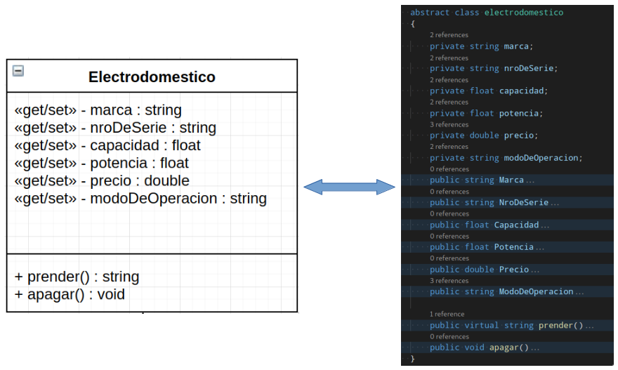
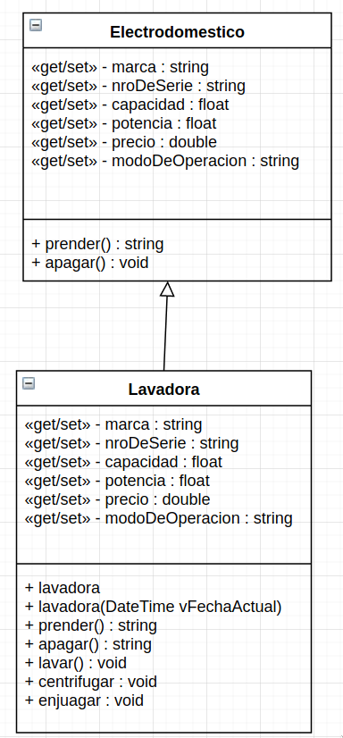

# Constructores de Un Clase e Introducción al UML - Diagrama de Clases 
---
## ¿Qué haremos en esta Clase
- Introducir los conceptos básicos del Diagrama de Clases, como un inicio al desarrollo de sistemas usando UML
- Explicar la importancia del Constructor de un Clase con un ejemplo práctico.
- Proponer un ejercicio evaluado cuya resolución cubra los temas aquí tratados.

---
## 1 Diagrama de Clases

UML es un lenguaje visual que nos sirve para hacer modelado de sistemas.  Es muy útil en la OOP ya que facilita el diseño y la depuracion de la aplicación aún antes de que se escriba una linea de código.


El diagrama de clases sirve para modelar la estructura estática de un sistema, así como describir los elementos del sistema y sus relaciones entre ellos.  Es el más utilizado de los diagramas que componen a [UML](https://es.wikipedia.org/wiki/Lenguaje_unificado_de_modelado) (lenguaje unificado de modelado). 


Se trata de un diagrama de estructura en que la representación de una clase incluye su nombre, los atributos y sus métodos en compartimentos separados. El superior de los compartimentos contiene el nombre de la clase, seguido del compartimento de los atributos y finalmente sus métodos; todo justificado a la izquierda excepto el nombre de la clase cuya inicial va en mayúscula.  


La nomenclatura de los permisos va a la izquierda del nombre del atributo/método y su simbología es la siguiente:


|  Nombre   | Símbolo |                                                   Descripción                                                   |
| :-------: | :-----: | :-------------------------------------------------------------------------------------------------------------: |
|  public   |    +    |                             Puede ser accesado por objetos  de cualquier otra clase                             |
|  private  |    +    |                                    Puede ser accesado solo desde esta clase                                     |
| protected |    #    | Puede ser accesado solo desde objetos  instanciados desde esta clase u objetos instanciados de clases heredadas |
|  paquete  |    ~    |              Puede ser accesado por objetos instanciados de clases que estén en el mismo paquete.               |


>UML no especifica un estandard para las propiedades o métodos de acceso a los atributos de la clase (getters y setters), así que en esta clase adoptaremos una [convención no oficial](https://stackoverflow.com/questions/28139621/
shortcut-for-denoting-or-implying-getters-and-setters-in-uml-class-diagrams) que muestra la permisología del atributo y la existencia de un mecanismo de acceso a c/u de ellos, si existiera.





Veámoslo con un ejemplo, el diagrama de clases de 'electrodomestico' y 'lavadora'. Aquí, las dos clases mantienen una relación de 'Generalización' ya que una extiende a la otra. Esto se representa con una flecha vacía y cerrada que parte de la subclase a la clase base. 





Existen diversas herramientas para crear diagramas UML y en concreto diagramas de clases.  Visio de Microsoft y Visual Paradigm son excelentes herramientas para esto.  También tiene algunos online y de acceso libre como [GitMind](https://gitmind.com/) o [AppDiagrams](https://app.diagrams.net/) con los que estan hechos los diagramas de esta clase.

En síntesis, el Diagrama de Clases:
- Es la base del Diseño Orientado a Objetos [OOD](https://es.wikipedia.org/wiki/Dise%C3%B1o_orientado_a_objetos)
- Presenta las clases del sistema con sus relaciones estructurales y de herencia.
- Es la herramienta central en la documentación de un sistema.  Comprender una estructura compleja es más fácil desde el diagrama de Clases que de la lectura del codigo.

> UML y el diagrama de clases son tópicos más amplios de lo visto aquí y que iremos profundizando en el desarrollo de este curso. Es además fundamental en su proceso de formación profesional.

## 2 Constructor de una Clase 

Cuando Ud. crea un objeto, C# reserva un espacio de memoria donde se inicia una instancia del tipo de la clase; acto seguido se ejecuta allí el código especificado en el constructor de la clase.

El constructor es un método especial que ejecuta lógica de programación en el instante de creación del objeto. Prepara al objeto para su operación. Generalmente se usa para iniciar los valores de los datos con los que va a trabajar el objeto.

Para implementarlo es necesario tener en cuenta las siguientes características, el metodo constructor de la clase:

- Tiene el mismo nombre de la clase
- No tiene tipo.

En nuestro ejemplo de la clase anterior, un constructor para la clase 'lavadora' sería este:

```
    public lavadora()
        {
            Console.WriteLine("Lavadora lista para iniciarse cuando lo indique");
        }
```

### 2.1 Sobrecarga del constructor.

El constructor es invocado automáticamente al momento de la instanciación; y es aquí cuando se especifican los parámetros.

Veámoslo con nuestro ejemplo de la clase anterior.  Imaginemos este caso.. solo podemos iniciar la lavadora en operación normal fuera del horario de cuarentena radical (de 7am a 2pm).  Entonces, asignaremos valores a los atributos desde el constructor de la clase, de acuerdo a la hora del día en que fue creado el objeto.  

Visto en el código, desde el Main instanciaremos la clase 'lavadora', esta vez pasando el parámetro `vAhora` que es una variable tipo fecha/hora (DateTime) que inicializamos con la fecha de hoy y la hora en el que es ejecutado este código:

```
     static void Main(string[] args)
        {
            DateTime vAhora = DateTime.Now;
            lavadora oLavadora = new lavadora(vAhora);
            Console.WriteLine(oLavadora.prender());
        }
```

Esto lo hacemos por que, definiremos un método constructor para la clase 'lavadora', así:

```
    public lavadora(DateTime vFechaActual)
        {            
            if (vFechaActual.Hour > 7 && vFechaActual.Hour < 14)
            { this.ModoDeOperacion = "Normal"; }
            else
            { this.ModoDeOperacion = "Lento"; }
            Console.WriteLine("La lavadora esta lista para prenderse y su modo de Operación será {0}", this.ModoDeOperacion);
        }
```

Como en C# todo es un objeto, una variable tipo DateTime es un objeto que tiene varios  atributos entre ellos la Hora (.Hour).  En el constructor verificamos la hora que recibe de parametro desde el Main y en consecuencia, inicializamos los valores de los atributos de la clase. Esto es lo que llamamos un **Constructor Parametrizado**.

>Sea precavido con la complejidad del codigo dentro del constructor, puede generar demoras en la creación de objetos.


## 3 Ejercicios Propuestos

Un sistema que emplea algoritmos de Inteligencia Artificial (IA) analiza imágenes y detecta-discrimina en ellas figuras y formas conocidas. El resultado del análisis de cada imagen retorna la cantidad de figuras conocidas y la resolución de las áreas y perímetros de c/u de las figuras que el sistema de IA le enviará, concretamente de las siguientes: Círculos, cuadrados, rectángulos, triángulos y elipses.

Su trabajo consiste en desarrollar una librería de Clases que resuelva los valores de perímetro y área de las figuras solicitadas. Tenga la tranquilidad de saber que el sistema le proporcionará todas las medidas de c/u de las figuras que hagan falta; solo debe recibirlas como parámetros.

Como cada análisis debe reportar cuantas figuras y de que tipo hay en cada imagen implemente un contador por cada instanciación que realize desde el programa principal. Además esto le será útil para verificar la correcta ejecución de su clase.

El [arquitecto de software](https://www.freelancermap.com/blog/es/que-hace-arquitecto-software/) requiere que Ud. haga este trabajo con las siguientes directrices:


| - 3.1 Para efectos de documentación debe entregar un diagrama de clases de la librería a desarrollar.<br><br>- 3.2 Encapsule los atributos de sus clases con getters/setters.<br><br>- 3.3 Implemente con constructores el anuncio de la disposición de su objeto a operar y la inicializacion de parámetros. <br><br>- 3.4 Eficiencia en la resuabilidad del código. |
| --------------------------------------------------------------------------------------------------------------------------------------------------------------------------------------------------------------------------------------------------------------------------------------------------------------------------------------------------------------------- |


<br>

**Fecha de entrega: Miercoles 26 de Mayo.**

<br>


> *Consejo de su Profesor*: No espere el último momento para iniciar esta labor. Revise el código de fuente de este repositorio. Inicie el trabajo con el Diagrama de Clases; use alguna herramienta online para esto, al perfeccionarse buscará alternativas más poderosas.  Para el 3.4, aplique la **abstracción**.  Así, un 'círculo', un 'cuadrado' etc. son todas 'figuras'.  Al mismo tiempo, un 'cuadrado' es un 'rectángulo' de lados iguales. Consulte las dudas que surjan a su Profesor (para esto el esta allí),  los estudiantes que hicieron esto en la asignación anterior lograron mejores resultados (por correo por favor).


