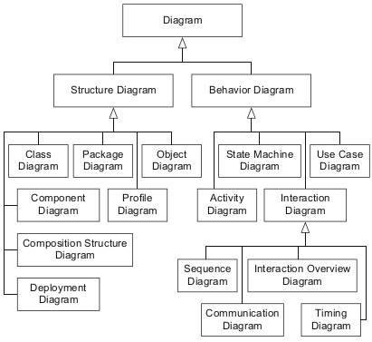
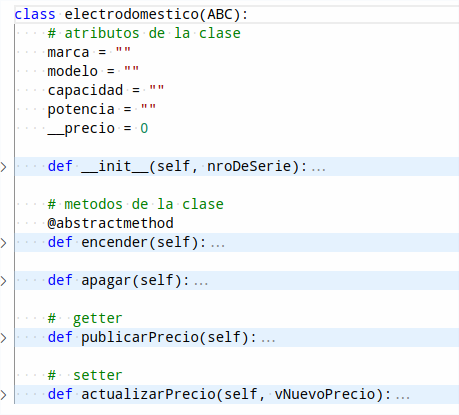
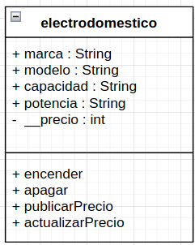

# Introducción al UML - Diagrama de Clases

---
## ¿Qué haremos en esta Clase

- Introducir los conceptos básicos del Diagrama de Clases, como un inicio al desarrollo de sistemas usando UML
- Proponer un ejercicio evaluado cuya resolución cubra los temas aquí tratados.
 
---

### UML

UML es un lenguaje visual que nos sirve para hacer modelado de sistemas.  Es muy útil en la OOP ya que facilita el diseño y la depuracion de la aplicación aún antes de que se escriba una linea de código.

---

| <i>Fuente: UML at Classroom - An Introduction to Object-Oriented Modeling, Martina Seidl</i>|

#### Diagrama de Clases

El diagrama de clases sirve para modelar la estructura estática de un sistema, así como describir los elementos del sistema y sus relaciones entre ellos.  Es el más utilizado de los diagramas que componen a [UML](https://es.wikipedia.org/wiki/Lenguaje_unificado_de_modelado) (lenguaje unificado de modelado). 

El diagrama de clases de un sistema, evoluciona la vida del mismo transcurre.  Su utilidad va desde el prototipado de un proyecto a la documentación de un sistema en producción. 

Se trata de un diagrama de estructura en que la representación de una clase incluye su nombre, los atributos y sus métodos en compartimentos separados. El superior de los compartimentos contiene el nombre de la clase, seguido del compartimento de los atributos y finalmente sus métodos; todo justificado a la izquierda excepto el nombre de la clase cuya inicial va en mayúscula.  

Veámoslo con un ejemplo, la clase electrodomestico:

La nomenclatura de los permisos va a la izquierda del nombre del atributo/método y su simbología es la siguiente:

|  Nombre   | Símbolo |                                                   Descripción                                                   |
| :-------: | :-----: | :-------------------------------------------------------------------------------------------------------------: |
|  public   |    +    |                             Puede ser accesado por objetos  de cualquier otra clase                             |
|  private  |    -    |                                    Puede ser accesado solo desde esta clase                                     |
| protected |    #    | Puede ser accesado solo desde objetos  instanciados desde esta clase u objetos instanciados de clases heredadas |
|  paquete  |    ~    |              Puede ser accesado por objetos instanciados de clases que estén en el mismo paquete.               |

Existen diversas herramientas para crear diagramas UML y en concreto diagramas de clases.  Visio de Microsoft y Visual Paradigm son excelentes herramientas para esto.  También tiene algunos online y de acceso libre como [GitMind](https://gitmind.com/) o [AppDiagrams](https://app.diagrams.net/) con los que estan hechos los diagramas de esta clase.

En síntesis, el Diagrama de Clases:
- Es la base del Diseño Orientado a Objetos [OOD](https://es.wikipedia.org/wiki/Dise%C3%B1o_orientado_a_objetos)
- Presenta las clases del sistema con sus relaciones estructurales y de herencia.
- Es la herramienta central en la documentación de un sistema.  Comprender una estructura compleja es más fácil desde el diagrama de Clases que de la lectura del codigo.

> UML y el diagrama de clases son tópicos más amplios de lo visto aquí y que iremos profundizando en el desarrollo de este curso. Es además fundamental en su proceso de formación profesional.

## Actividades Propuestas

El diagrama de clases incluye un estandard para la herencia y clases abstractas.  Usando el ejemplo del electrodomestico de esta clase, 
- Haga la clase 'electrodomestico' abstracta y diagramelo de acuerdo al estandard.  (1pt)
- Cree una clase que herede de 'electrodomestico' (p. ejem. lavadora) y diagramelo de acuerdo al estandard.  (1pt)