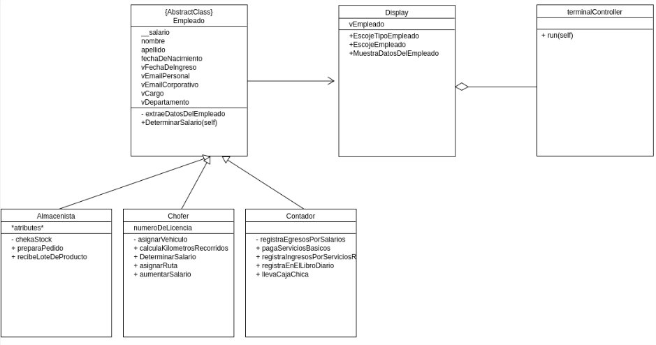

## Ejercicio Resuelto 

Los arquitectos de software de una empresa deben migrar todas las aplicaciones de recursos humanos a arquitectura MVC, manteniendo la lógica original del negocio. 

La especificación del requerimiento se da desde el diagrama de clases:



## Resolución

### Modelo:

Para  el código que corresponde al Modelo del patrón MVC, vamos a definir la clase xxx.  Como corresponde a la naturaleza del patron, aquí van todas las operaciones que se van a ejecutar sobre los datos propios de la aplicación de acuerdo a las reglas de negocio.

En un esquema MVC, es el modelo quien se entiende directamente con la Base de Datos de una aplicación.  En el nivel en el que se encuentra esta cátedra, no está planteado cubrir contenidos de la materia Base de Datos, por lo que emularemos su funcionamiento con dos estructuras de datos del tipo Diccionario que son `vAlmacenDeDatos` y `vDiccionarioTiposDeEmpleados`.

Diccionario para tipo de empleados:

```
vDiccionarioTiposDeEmpleados = {
    1: 'almacenista', 2: 'chofer', 3: 'contador'
}

```
Diccionario con los datos de los empleados:

```
vAlmacenDeDatos = {
    'empleado': {
        'almacenista': [
            {
                "ci": "20111222", "nombre": "Truman", "apellido": "Capote", "salario": 7, "fechaDeNacimiento": datetime.datetime(2012, 12, 20, 0, 0), "fechaDeIngreso": datetime.datetime(2012, 12, 20, 0, 0)},
            {
                "ci": "20333444", "nombre": "Albert", "apellido": "Camus", "salario": 4, "fechaDeNacimiento": datetime.datetime(2012, 12, 20, 0, 0), "fechaDeIngreso": datetime.datetime(2012, 12, 20, 0, 0)}],
        'chofer': [
            {
                "ci": "20555666", "nombre": "Gustav", "apellido": "Flaubert", "salario": 3, "fechaDeNacimiento": datetime.datetime(2012, 12, 20, 0, 0), "fechaDeIngreso": datetime.datetime(2012, 12, 20, 0, 0)},
            {
                "ci": "20777888", "nombre": "Emile", "apellido": "Cioran", "salario": 4, "fechaDeNacimiento": datetime.datetime(2012, 12, 20, 0, 0), "fechaDeIngreso": datetime.datetime(2012, 12, 20, 0, 0)}]
    }
}
```

Seguidamente, definiremos la superclase `Empleado`, la creamos como abstracta y declaramos sus atributos:

```
class Empleado(ABC):  # Super Clase o Clase Base
    __salario = 0
    nombre = None
    apellido = None
    fechaDeNacimiento = None
    vFechaDeIngreso = None
    vEmailPersonal = None
    vEmailCorporativo = None
    vCargo = None
    vDepartamento = None

```
y su constructor:

```
 def __init__(self, vCedula, vTipoDeEmpleado):  # constructor de la superclase
        self.cedulaDeIdentidad = vCedula
        self.__tipoDeEmpleado = vTipoDeEmpleado
        vDatosDelEmpleado = self.extraeDatosDelEmpleado(
            vCedula, vTipoDeEmpleado)
        if vDatosDelEmpleado != []:
            self.nombre = vDatosDelEmpleado[1]
            self.apellido = vDatosDelEmpleado[2]
            self.__salario = vDatosDelEmpleado[3]
            self.fechaDeNacimiento = vDatosDelEmpleado[4]
        else:            
            self.nombre = self.apellido = self.__salario = self.fechaDeNacimiento = "Empleado no encontrado"
    
```

Revisemos los métodos.

`extraeDatosDelEmpleado`:
Invocado desde el metodo constructor, acepta como parámetros la cédula del empleado y su tipo.  Usado para inicializar los atributos del empleado en la instanciación.

```
def extraeDatosDelEmpleado(self, cedulaDeIdentidad, vTipoDeEmpleado):
        vResult = []
        vAlmacenistas = vAlmacenDeDatos['empleado'][vDiccionarioTiposDeEmpleados[int(
            vTipoDeEmpleado)]]
        for vIndex in vAlmacenistas:
            if vIndex.get('ci') == cedulaDeIdentidad:
                vResult = list(vIndex.values())
            else:
                pass
        return vResult
```

### Vista:

Para  el código que corresponde a la Vista del patrón MVC, vamos a definir la clase `display`. Como corresponde a la naturaleza del patrón, aquí va la lógica de interacción con el usuario de la aplicación.  En este caso en particular el medio de interacción es la pantalla de terminal de python, pero puede ser html, api etc.

Veamos los métodos de la clase `display`:

- `EscojeTipoEmpleado` : Recibe el tipo de empleado que va a ser tratado.  Puede tener como entrada '1' si es almacenista, '2' si es chofer etc, de acuerdo como esta definido en el diccionario `vDiccionarioTiposDeEmpleados` en el modelo. 
  
```
    def EscojeTipoEmpleado(self):
        vResult = None
        vResult = input("seleccione el tipo de empleado:")
        return vResult
```

- `EscojeEmpleado`: Recibe el nro. de cédula del empleado que va a ser tratado.  
```
    def EscojeEmpleado(self):
        vResult = None
        vResult = input("Tipee el nro. de cédula del empleado: ")
        return vResult
```

- `MuestraDatosDelEmpleado`: Usa la librería `terminaltables` para armar una tabla con los resultados de la consulta de datos del empleado.  

```
    def MuestraDatosDelEmpleado(self, vEmpleado):        
        vData = [
            [Color('Cédula'), Color('{autocyan}Nombre{/autocyan}'), Color(
                '{autocyan}Apellido{/autocyan}'), Color('Salario'), Color('F. Nac')],
            [vEmpleado[0], vEmpleado[2], vEmpleado[3], vEmpleado[4], vEmpleado[5]]
        ]

        vResult = SingleTable(vData, ' '+' '.join(vEmpleado[2:4])+' ')
        vResult.inner_heading_row_border = False
        vResult.inner_row_border = True

        vResult.justify_columns = {0: 'center', 1: 'center', 2: 'center'}
        print(vResult.table)
```

### Controlador:

Para  el código que corresponde al Controlador del patrón MVC, vamos a definir la clase `terminalController`.  Como corresponde a la naturaleza del patrón, aquí va la conexión y enrutamiento de datos entre la vista y el modelo. Esto se hace notar, si observa la cabecera del módulo:

```
#!/usr/bin/python3
import modelo
import vista

```

Desde el método constructor se instancia la clase correspondiente al tipo de empleado seleccionado (almacenista, chofer etc.). 

```
 def __init__(self):
        self.view = vista.display()
        self.__tipoDeEmpleado = self.view.EscojeTipoEmpleado()
        if (self.__tipoDeEmpleado == '1'):
            self.model = modelo.Almacenista(
                self.view.EscojeEmpleado(), self.__tipoDeEmpleado)
        elif (self.__tipoDeEmpleado == '2'):
            self.model = modelo.chofer(
                self.view.EscojeEmpleado(), self.__tipoDeEmpleado)

```

En este método `run` vemos el enrutamiento entre la vista y el modelo.  El método de la vista `MuestraDatosDelEmpleado` recibe como parámetro los valores de los atributos del objeto `self.model` (nombre, apellido, fechaDeNacimiento, vFechaDeIngreso, etc.) transformados en una lista.  

```
def run(self):        
        self.view.MuestraDatosDelEmpleado(list(self.model.__dict__.values()))
```

## Ejercicio Propuesto (40%)


Un sistema desea consumir su desarrollo como una API.  Cree un método en el modelo (concretamente, un getter) que produzca esta salida:

El empleado <nombre y apellido> de Cédula de Identidad: <nro. de cédula> recibe un salario de: <salario>

Ejemplo: 

```
Seleccione el tipo de empleado:1
Tipee el nro. de cédula del empleado: 20111222
El empleado Truman Capote de Cédula de Identidad: 20111222 recibe un salario de: 7
```

- Validez del nombre del método [de acuerdo a estas directivas](https://drive.google.com/file/d/1dpgruCpPjO-hOiJs8UOHeDJWp_IKAnc7/view?usp=sharing)
- Validez de la salida

Investigación:
- Mencione al menos 4 ventajas de adoptar el patron MVC en su desarrollo.
- Mencione al menos 4 beneficios de implementar el uso del diagrama de clases en un proceso de desarrollo. 


